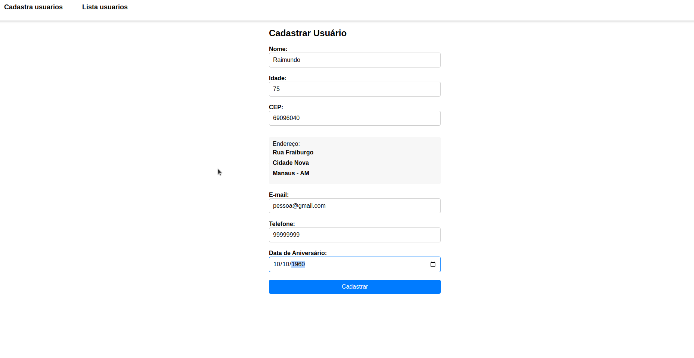
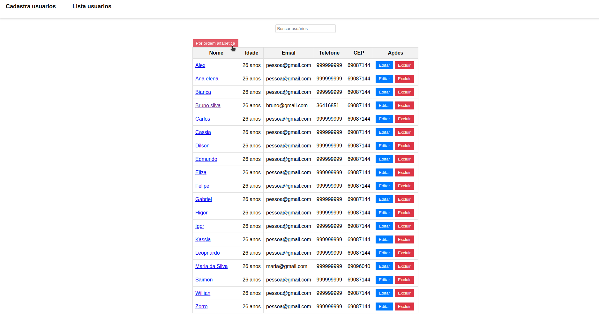
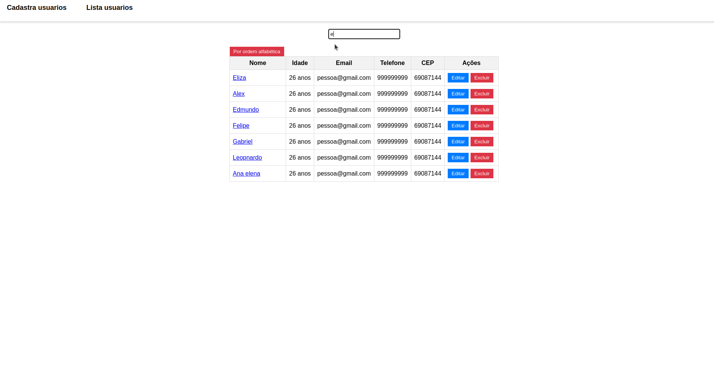
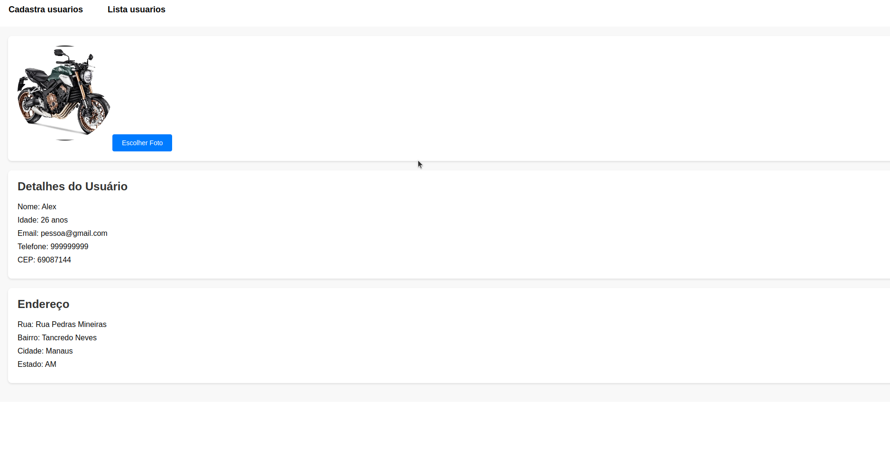

╔════════════════════════════════════════════════╗
║                # OMNI-CRUD-CONNECT             ║
╚════════════════════════════════════════════════╝
## Cadastrar 1
 

## Lista usuarios, deleta e atualizar

## Busca

## Verifica informações 

╔════════════════════════════════════════════════╗
║                Setup do Projeto                ║
╚════════════════════════════════════════════════╝

Este documento descreve o processo de setup para a execução do projeto OmniCrudConnect. Siga as instruções abaixo para configurar o ambiente de desenvolvimento e executar o projeto.

╔════════════════════════════════════════════════╗
║            Configuração do Backend (Laravel)           ║
╚════════════════════════════════════════════════╝

1. Clone o repositório do projeto:

   git clone <URL_DO_REPOSITÓRIO_BACKEND>

2. Acesse o diretório do backend:

   cd nome-do-projeto-backend

3. Copie o arquivo .env.example e renomeie-o para .env:

   cp .env.example .env

4. Edite o arquivo .env e defina as configurações do banco de dados e outras configurações necessárias.

5. Instale as dependências do projeto:

   composer install

6. Gere uma nova chave de aplicativo:

   php artisan key:generate

7. Execute as migrations e seeders para criar as tabelas e popular o banco de dados:

   php artisan migrate --seed

8. Inicie o backend:

   ./vendor/bin/sail up

O backend do projeto estará sendo executado na porta 8000.

╔════════════════════════════════════════════════╗
║           Configuração do Frontend (React)             ║
╚════════════════════════════════════════════════╝

1. Clone o repositório do projeto:

   git clone <URL_DO_REPOSITÓRIO_FRONTEND>

2. Acesse o diretório do frontend:

   cd nome-do-projeto-frontend

3. Instale as dependências do projeto:

   npm install

4. Copie o arquivo .env.example e renomeie-o para .env:

   cp .env.example .env

5. Edite o arquivo .env e defina as configurações do backend (URL de acesso à API, por exemplo).

6. Inicie o frontend:

   npm start

O frontend do projeto estará sendo executado na porta 3000.

╔════════════════════════════════════════════════╗
║                  C4 Model               ║
╚════════════════════════════════════════════════╝

## Sistema: Laravel Sail Application

Container:
- Pasta do projeto Laravel
- Arquivo docker-compose.yml

Componentes:
- Laravel Application (código-fonte do aplicativo Laravel)

Camada de Abstração:
- Camada de Aplicação:
  - Laravel Application

Pacotes:
- Banco de Dados:
  - MySQL (usado como banco de dados padrão)
- Serviços de Apoio:
  - Loggers
  - Cache
  - Serviços de Email

## Sistema: React Application

Container:
- Pasta src
- Pasta public
- Pasta node_modules
- Arquivo Dockerfile

Componentes:
- Button (localizado na pasta src/components)
- Header (localizado na pasta src/components)

Camada de Abstração:
- Camada de Apresentação:
  - Componentes Button e Header

Pacotes:
- Pasta assets (localizada na pasta src)
- Pasta containers (contém as páginas Home e Users)
- Pasta routes (gerencia as rotas do aplicativo)
- Pasta styles (contém estilos CSS para o aplicativo)

╔════════════════════════════════════════════════╗
║                  Acesso ao Projeto                 ║
╚════════════════════════════════════════════════╝

## Acesse o projeto em seu navegador:

- Backend: http://localhost:8000
- Frontend: http://localhost:3000

Certifique-se de revisar as URLs e as configurações específicas do seu projeto e faça os ajustes necessários.

